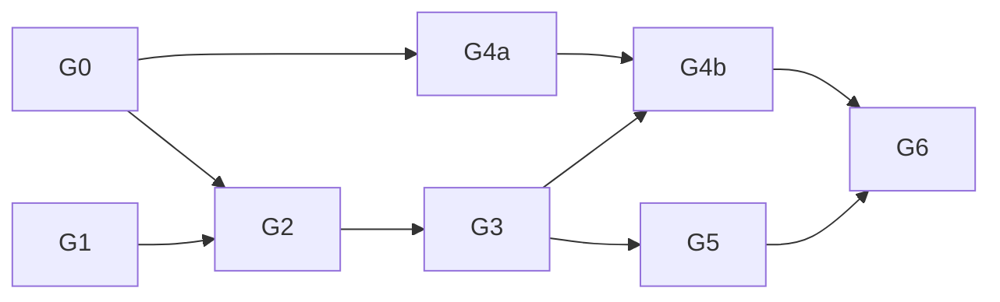

# Roadmap

Owner: operator. The mayor ranks work against this file in [NOW.md](NOW.md).
Scope and evidence rules are in [CHARTER.md](CHARTER.md).

## Gates

A gate is a live test on real binaries. The full Steam 1.8 matrix on all five
targets is the release gate (G6), not a precondition for testing.

| Gate | Exit evidence | Where | KPIs | Estimate |
| --- | --- | --- | --- | --- |
| **G0 Baseline** | The fork's x86 MP client and headless dedicated server start on Steam 1.8 data and load 3 stock maps; one fork-to-fork round is played. The same binaries run under Wine on Linux amd64. | Windows x86; Wine | - | 1-3 days, owner |
| **G1 Compiles and links** | The headless set compiles with 0 errors on Win64, Linux amd64 and Linux arm64. Win64 and Linux headless link with no disabled asserts. The loader explicitly refuses 64-bit loads until G2. | Win64, then Linux | K1, K2, K5 | Win64 1-2 weeks; Linux platform work 2-6 weeks in parallel |
| **G2 Boots** | Loads one stock map from unmodified Steam 1.8 `.ff` under ASan/UBSan, answers `getinfo`/`getstatus`, rotates through 5 stock maps, and runs 30 minutes without faults. | Win64, then Linux amd64 | K3, K4 | 13-22 weeks on the critical path (loader 8-14, hazards 3-4, first run 4-6) |
| **G3 Fork-peer play** | An x86 fork client joins the native server and plays a full round, a map change and a reconnect, with 8 test clients. | Win64, Linux amd64/arm64, macOS arm64 headless | K6 | 1-2 weeks per target after G2 |
| **G4a Steam 1.8 on x86** | An unmodified Steam 1.8 client discovers, connects, plays, changes map and reconnects on the fork's x86 server. | Windows x86 | - | 6-12 weeks (12-20 if in-band formats changed); starts when captures arrive |
| **G4b Steam 1.8 on native** | The G4a matrix against every G3 server. | 5 headless targets | K6 | Small, once G4a and G3 are done |
| **G5 Native client** | A Win64 D3D9 interim client plays on a fork server, then on a Steam 1.8 server. Linux and macOS go through dxvk-native as an interim. Vulkan replaces both before G6. | Win64, then Linux, then macOS | K6 | Win64 D3D9 2-4 months after G2; dxvk-native +1-2 months; Vulkan 6-12 months |
| **G6 Release** | 5 targets x 2 roles packaged; native client joins a Steam 1.8 server and a Steam 1.8 client joins a native server; macOS signed and notarized; provenance recorded. | All | K6 | After G5 |

Windows ARM64 builds the Win64 source set; its first run is at G3.

A Win64 process can't load the 32-bit Miles or Bink DLLs. The G5 interim
client therefore needs OpenAL Soft and FFmpeg, or silent stubs, from its first
build.

Estimates are ranges for one strong engineer, with low confidence. They don't
convert to swarm time.

## Test vehicles

Vehicles are test milestones, never deliverables
([ADR-0003](decisions/0003-testing-gates-and-vehicles.md)).

| Vehicle | Runs | Used for |
| --- | --- | --- |
| Wine/Proton + DXVK | x86 build on Linux | G0 on Linux, G4a harness hosts |
| Windows-on-ARM x86 emulation | x86 build on Windows ARM64 | Early ARM64 smoke |
| CrossOver on macOS | x86 headless only | Early macOS smoke |
| Win64 client on the D3D9 renderer | Win64 | G5 interim |
| dxvk-native | Linux and macOS clients | G5 interim |
| 32-bit Linux headless server (optional) | Linux x86 | Only if the POSIX layer is ready well before the loader |

## Workstreams

| Workstream | Gate | Design doc |
| --- | --- | --- |
| WS-1 native64 compile closure | G1 | [NATIVE64.md](design/NATIVE64.md) |
| WS-2 two-layout loader | G2 | [FASTFILE_LOADER.md](design/FASTFILE_LOADER.md) |
| WS-3 silent hazards | G2 | [NATIVE64.md](design/NATIVE64.md) / [DETERMINISM.md](design/DETERMINISM.md) |
| WS-4 POSIX headless platform | G1 (Linux) / G2 | [PLATFORM_POSIX.md](design/PLATFORM_POSIX.md) |
| WS-5 Steam 1.8 wire | G4a / G4b | [NET_STEAM18.md](design/NET_STEAM18.md) |
| WS-6 client | G5 | [CLIENT.md](design/CLIENT.md) |
| WS-7 CI/KPI hygiene | enabler | - |
| WS-8 repo/legal hygiene | enabler | - |

The critical path is G1, then G2 (WS-1, WS-2, WS-3, WS-4). WS-5 runs in
parallel on the x86 build once captures exist. WS-6 waits for G2 except for
design spikes. WS-7 and WS-8 take a bead only when it unblocks a gate.

## Test maps (proposal; owner to confirm)

Stock MP maps from the Steam 1.8 install, used by G0, G2, G3 and G4. The
first five form the G2 rotation.

| Map | Size | Role |
| --- | --- | --- |
| `mp_shipment` | tiny | Proposed G2 first boot map |
| `mp_vacant` | small | G2 rotation |
| `mp_crash` | medium | G0 map, G2 rotation |
| `mp_backlot` | medium | G0 map, G2 rotation |
| `mp_overgrown` | large | G0 map, G2 rotation |
| `mp_showdown` | small | G3/G4 matrix |
| `mp_strike` | medium | G3/G4 matrix |
| `mp_citystreets` | medium | G3/G4 matrix |
| `mp_convoy` | medium | G3/G4 matrix |
| `mp_countdown` | large | G3/G4 matrix |

## Open questions

1. Are the Activision master and authorize services still alive?
2. Does the Steam 1.8 exe run with `+set dedicated`?
3. Which map is G2's boot map (`mp_shipment` proposed)?
4. Do test clients work in the fork's build?
5. Is the x86 build a shipped artifact after G6?
